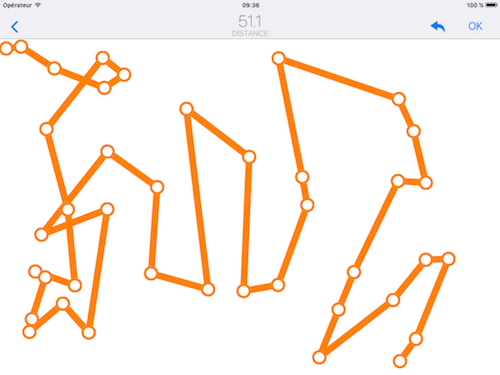

# App-ShortestPath
This is an iOS App game where people have to find the shortest path linking all the components. We used to compare the best human path with some obtained using algorithms (tabou, firefly, genetic).

Check the folder [Symposium_optimization](https://github.com/laurencee9/Symposium_optimization) for more details.

**History** 
2016 : Physique Numérique - Université Laval - Symposium Dynamica 

**Compatibility** 
iPads iOS 8 + 
iPhone 5s, 6, 6s, iOS 8+

*The code is optimized for iPad in landscape mode.*

**Note** 
This app was developed in less than a week so the code is not as clean as I want.

